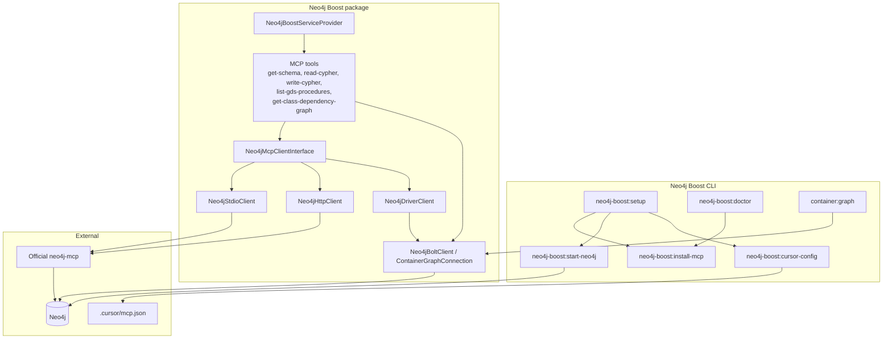
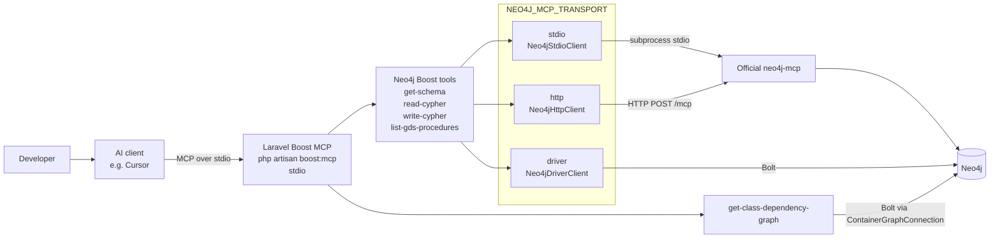
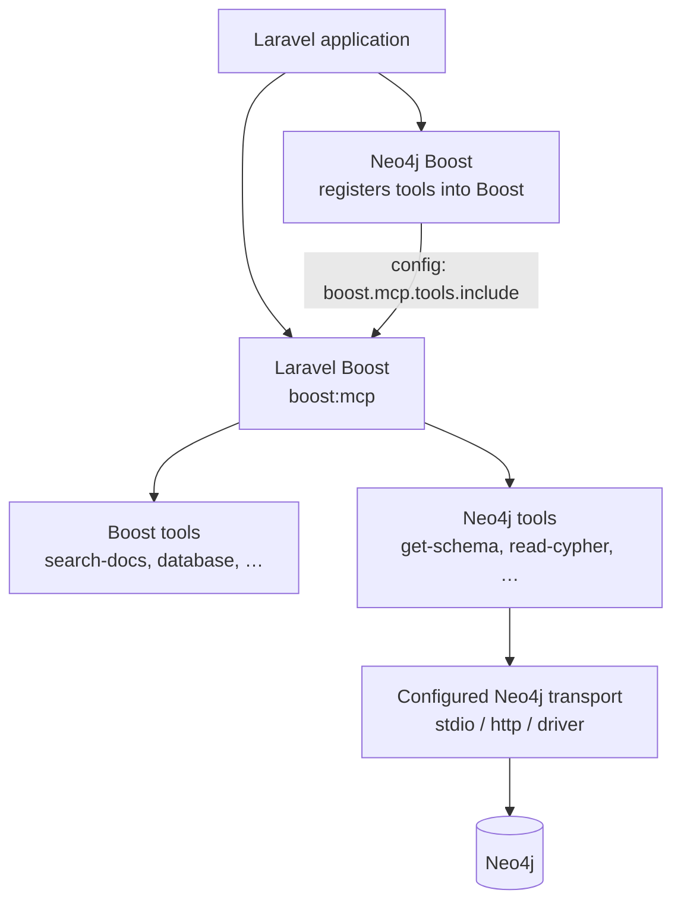
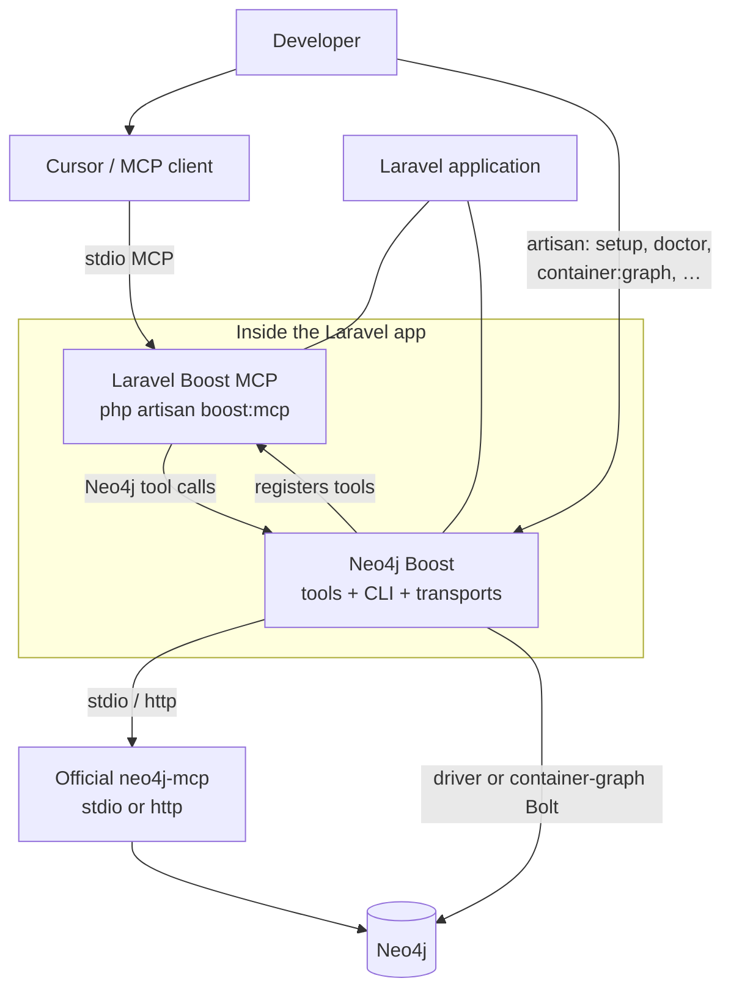
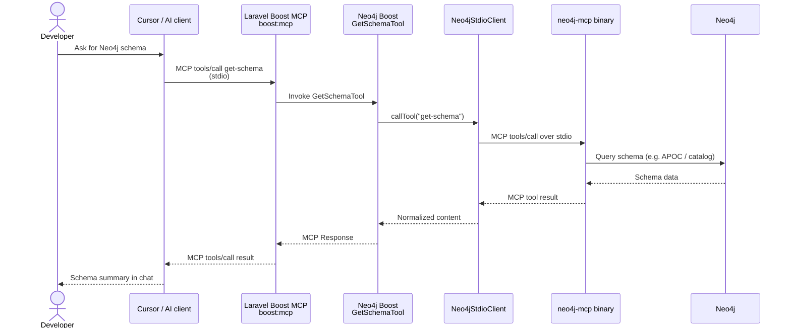

# Neo4j Boost Architecture

This page explains how Neo4j Boost (`neo4j/laravel-boost`) fits together with Laravel Boost, MCP clients (such as Cursor), the official Neo4j MCP server, and Neo4j.

It describes the **current implementation** in this repository. For install steps, env vars, and troubleshooting, see the [README](../README.md).

---

## 1. Neo4j Boost Architecture

Neo4j Boost is a Laravel package. Its service provider registers Artisan commands and merges Neo4j MCP tools into Laravel Boost’s tool list. AI clients do not talk to Neo4j Boost as a separate MCP process by default; they talk to **Laravel Boost’s** MCP server (`php artisan boost:mcp`), which exposes both Boost tools and Neo4j tools.

**What this shows:** Setup and doctor manage the local `neo4j-mcp` binary, Neo4j Docker (optional), and Cursor MCP config. Cypher/schema tools go through `Neo4jMcpClientInterface` and the configured transport (`stdio`, `http`, or `driver`). The container-graph command and `get-class-dependency-graph` use Bolt directly via `Neo4jBoltClient`, not the Neo4j MCP binary.

Related: [README – Artisan commands](../README.md#artisan-commands), [README – Configuration](../README.md#configuration).

---

## 2. MCP Integration

Cursor (or another MCP-compatible client) connects to Laravel Boost over **stdio**. Neo4j Boost tools then reach Neo4j using one of three package transports, selected by `NEO4J_MCP_TRANSPORT` (default: `stdio`).

**What this shows:** The client↔Boost hop is always MCP over stdio when using the recommended `laravel-boost` entry in `.cursor/mcp.json`. From there:

| Transport | How Neo4j tools run | Needs `neo4j-mcp` binary? |
|-----------|---------------------|---------------------------|
| `stdio` (default) | Package spawns local `neo4j-mcp` and speaks MCP over stdin/stdout | Yes |
| `http` | Package POSTs to `NEO4J_MCP_URL` (e.g. `http://localhost:8080/mcp`) | Separate HTTP MCP process |
| `driver` | In-process Bolt via `laudis/neo4j-php-client` | No |

`get-class-dependency-graph` always uses the container-graph Bolt path. Official Neo4j MCP tool names proxied by the other tools: `get-schema`, `read-cypher`, `write-cypher`, `list-gds-procedures`.

Related: [README – Single MCP server with Laravel Boost](../README.md#single-mcp-server-with-laravel-boost), [README – Using with Cursor](../README.md#using-with-cursor).

---

## 3. Laravel Boost Integration

Laravel Boost and Neo4j Boost share **one** MCP server process. Neo4j Boost does **not** open a second MCP connection from Boost to Neo4j Boost. Instead, `Neo4jBoostServiceProvider` appends Neo4j tool classes to `boost.mcp.tools.include` so `boost:mcp` exposes them alongside Boost’s own tools.

**What this shows:** Both packages live in the same Laravel app. Cursor is configured with a single `laravel-boost` server (`php artisan boost:mcp`). Neo4j Boost’s role is registration + transport clients + CLI helpers—not a peer MCP server that Laravel Boost calls.

If Laravel Boost’s `ToolRegistry` were absent, `neo4j-boost:cursor-config` would fall back to an HTTP `neo4j-boost` URL entry. In normal installs this package **requires** `laravel/boost`, so the single-server `laravel-boost` path is the supported model.

Related: [README – Single MCP server with Laravel Boost](../README.md#single-mcp-server-with-laravel-boost).

---

## 4. Overall Neo4j Boost Ecosystem

High-level view of how a developer, Cursor, the Laravel app, Laravel Boost, Neo4j Boost, and Neo4j relate.

**What this shows:** The developer uses Cursor for AI tool calls and Artisan for setup/diagnostics/export. Cursor only needs one MCP server. Neo4j Boost sits inside the Laravel app, feeds tools into Laravel Boost, and connects to Neo4j either through official `neo4j-mcp` or directly over Bolt.

---

## 5. Typical Request / Data Flow

Example: the developer asks Cursor for the graph schema. Cursor calls `get-schema` on the Laravel Boost MCP server. With the default **stdio** transport, Neo4j Boost forwards that call to the local `neo4j-mcp` binary, which queries Neo4j and returns the result up the chain.

**What this shows:** End-to-end path for a schema request on the default transport. For `http`, `Neo4jHttpClient` replaces the stdio client and POSTs to `/mcp`. For `driver`, `Neo4jDriverClient` talks to Neo4j over Bolt with no `neo4j-mcp` process. A `read-cypher` / `write-cypher` flow is the same shape with different tool names and arguments.

`get-class-dependency-graph` skips `neo4j-mcp` and reads previously exported container-graph data from Neo4j over Bolt (`ClassDependencyGraphReader`). Export that data first with `php artisan container:graph`.

Related: [README – Container Graph POC](../README.md#container-graph-poc-llm-debugging).

---

## Component quick reference

| Component | Role |
|-----------|------|
| Laravel Boost (`boost:mcp`) | MCP server Cursor connects to (stdio) |
| Neo4j Boost tools | Proxies official Neo4j MCP tools (+ DI graph tool) |
| `neo4j-mcp` | Official Neo4j MCP server (stdio subprocess or HTTP) |
| `Neo4jDriverClient` | Optional in-process Bolt implementation of the same tool names |
| `container:graph` | Exports Laravel DI wiring into Neo4j |
| `neo4j-boost:doctor` | Checks transport readiness (binary, password, HTTP reachability) |
| `.cursor/mcp.json` | Written by `neo4j-boost:cursor-config` with a `laravel-boost` entry |
