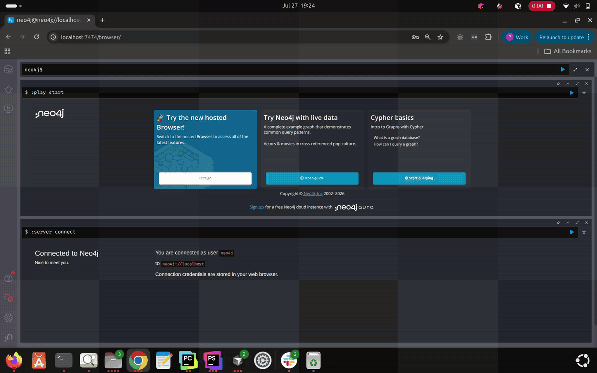

# Debug Laravel DI with the Container Graph

## Introduction

Laravel’s service container records how abstractions bind to implementations and how classes receive constructor dependencies. Route handlers and middleware sit on top of that wiring. The result is usually scattered across service providers, type-hints, and route files—hard to see as a whole when debugging “what injects into X?” or “which middleware runs on this route?”

Neo4j Boost can **export** that runtime wiring into Neo4j as a graph, then let you explore it in Neo4j Browser or via the MCP tool `get-class-dependency-graph`.

This is an **advanced** workflow. Complete [Getting Started](getting-started.md) (and ideally [Using Neo4j MCP Tools in Cursor](cursor-mcp-tools.md)) first so Neo4j is reachable and Cursor MCP works if you want the AI path.

## Prerequisites

You need:

- A working Neo4j Boost install — see [Getting Started](getting-started.md)
- A reachable Neo4j instance for the **container graph Bolt connection** (separate from MCP transport selection)
- Credentials configured for that connection (see below)

Optional but useful:

- Neo4j Browser (`http://localhost:7474` when using `neo4j-boost:start-neo4j`)
- Cursor with `laravel-boost` connected, if you will call `get-class-dependency-graph` from the agent

### Connection env for `container:graph`

The export writes over Bolt using the package’s Neo4j client (not the MCP `stdio`/`http` hop). Typical local `.env`:

```env
NEO4J_URI=bolt://localhost:7687
NEO4J_USER=neo4j
NEO4J_PASSWORD=your-password
```

`NEO4J_USERNAME` is accepted as a fallback for `NEO4J_USER`. If `NEO4J_URI` is empty, `NEO4J_DEFAULT_CONNECTION_DSN` may be used (full URL, optionally with embedded user/password). Inside Docker, prefer the Neo4j service hostname—not `localhost` from another container.

Details: [README – Exploring Your Container Dependency Graph](../../README.md#exploring-your-container-dependency-graph).

## What the Container Graph Represents

`php artisan container:graph` snapshots:

1. **Routes** from the live Laravel router (controller / invokable handlers; closures are skipped)
2. **Route middleware** after groups and aliases are expanded (`Router::gatherRouteMiddleware()`)
3. **Container bindings** from `app()->getBindings()` (abstract → concrete)
4. **Constructor and method-injection dependencies** for concrete classes
5. **Optional static-scan edges** when `NEO4J_CONTAINER_GRAPH_STATIC_SCAN_PATHS` is set
6. **Project classes** discovered from production PSR-4 autoload paths in `composer.json` (not `autoload-dev`)

### Runtime node labels

| Label | Unique key | Meaning |
|--------|------------|---------|
| `:Route` | `key` (method + URI, e.g. `GET /api/contracts`) | HTTP route. `name` is Laravel’s route name (empty when unnamed). |
| `:Middleware` | `key` | Middleware after alias/group expansion. `name` matches `key` for Browser captions. |
| `:Instance` | `name` | Concrete class inspected from the container / PSR-4 scan |
| `:Dependency` | `key` | A dependency occurrence on an instance |
| `:Identifier` | `name` | Class, interface, or alias used to resolve a handler, middleware, or dependency |

Bindings still also export `:Abstract` nodes with `BINDS_TO` (interface/class binding keys).

### Runtime relationships

```text
(:Route)-[:HANDLED_BY]->(:Identifier)-[:RESOLVES_TO {lifetime}]->(:Instance)
  -[:DEPENDS_ON]->(:Dependency)-[:IDENTIFIED_AS]->(:Identifier)
(:Route)-[:USES_MIDDLEWARE {order,parameters}]->(:Middleware)-[:IDENTIFIED_AS]->(:Identifier)
```

| Type | Meaning | Properties |
|------|---------|------------|
| `HANDLED_BY` | Route action → controller/invokable identifier | — |
| `USES_MIDDLEWARE` | Route → middleware in pipeline order | `order`, `parameters` (e.g. `auth:api` → `parameters: api`) |
| `IDENTIFIED_AS` | Dependency or middleware → identifier | — |
| `RESOLVES_TO` | Identifier → instance | `lifetime` (`singleton` or `bind`) |
| `DEPENDS_ON` | Instance → dependency | `type`, `file`, `line`, `via`, `method`, `parameter`, metadata |
| `BINDS_TO` | Abstract binding key → concrete | `type` (`normal` / `singleton`) plus edge metadata |
| `CONTEXTUAL_BINDS` | Contextual `when/needs/give` | `needs`, `needs_kind`, `reason` |

## Export the Laravel Container Graph

```bash
php artisan container:graph
```

### What it does

1. Extracts binding rows and concrete class names from the Laravel container.
2. Extracts controller routes and expanded middleware from the live router.
3. Scans production PSR-4 paths for additional project classes.
4. Reflects constructors (and method injection) to build `DEPENDS_ON` chains.
5. Prints a summary (bindings, instances, route handlers, route middleware links, static edges, unresolved count).
6. Unless `--dry-run`, connects to Neo4j and runs `MERGE`-based Cypher writes.

On success you see:

```text
Container graph written to Neo4j successfully.
```

### Options

| Option | Behavior |
|--------|----------|
| `--dry-run` | Extract and summarize only; **no** Neo4j write |
| `--print-cypher` | Print the writer’s Cypher templates and a small sample of params before writing (or with dry-run) |

```bash
php artisan container:graph --dry-run
php artisan container:graph --print-cypher
```

### Idempotency (not a full wipe)

Writes use **`MERGE`**. Re-running the command does not duplicate the same nodes/relationships for the same names. The command does **not** delete obsolete nodes from an earlier export if bindings were removed in PHP—treat re-runs as upserts of the current snapshot, not a guaranteed clean replace of the whole graph.

## Explore the Graph with Neo4j Browser



Open Neo4j Browser (for local Docker Neo4j from setup: `http://localhost:7474`), sign in with your Neo4j user/password, then run:

**Route, handler, dependencies, and middleware (graph view):**

```cypher
MATCH (r:Route)-[:HANDLED_BY]->(:Identifier)-[:RESOLVES_TO]->(root:Instance)
OPTIONAL MATCH deps = (root)-[:DEPENDS_ON|IDENTIFIED_AS|RESOLVES_TO*0..8]->(n)
OPTIONAL MATCH mw = (r)-[:USES_MIDDLEWARE]->(:Middleware)-[:IDENTIFIED_AS]->(:Identifier)
RETURN r, root, deps, mw
LIMIT 25;
```

**Middleware pipeline as a graph (return paths, not scalar columns):**

```cypher
MATCH path = (r:Route)-[u:USES_MIDDLEWARE]->(m:Middleware)-[:IDENTIFIED_AS]->(id:Identifier)
RETURN path
ORDER BY r.key, u.order
LIMIT 50;
```

**Middleware names as a table:**

```cypher
MATCH (r:Route)-[u:USES_MIDDLEWARE]->(m:Middleware)-[:IDENTIFIED_AS]->(id:Identifier)
RETURN r.key AS route, u.order AS order, m.name AS middleware, u.parameters AS parameters
ORDER BY route, order
LIMIT 50;
```

**Walk dependencies of one class** (replace the name with a class that exists in *your* export):

```cypher
MATCH (i:Instance {name: 'App\\Services\\FooService'})-[d:DEPENDS_ON]->(dep:Dependency)-[:IDENTIFIED_AS]->(id:Identifier)
RETURN i.name, dep.key, id.name, d.type
LIMIT 25;
```

Tips:

- Return **paths or nodes** (`RETURN path`) for the Graph tab. `RETURN r.key, m.name` is table-only.
- Caption Route on `key`, Middleware on `name`, Identifier/Instance on `name`.
- You can also run the same Cypher via MCP `read-cypher` (see [cursor-mcp-tools.md](cursor-mcp-tools.md)); for “what does class X depend on?” prefer `get-class-dependency-graph`.

## Query the Dependency Graph with MCP


Tool name: **`get-class-dependency-graph`**

It is registered on `php artisan boost:mcp` with Neo4j Boost’s other tools. Unlike `get-schema` / `read-cypher` / `write-cypher`, it reads Neo4j **directly** through the container-graph Bolt connection (`ClassDependencyGraphReader` → `ContainerGraphConnection`). It does **not** go through the official `neo4j-mcp` binary.

### Parameters

| Parameter | Required | Default | Description |
|-----------|----------|---------|-------------|
| `class` | Yes | — | Fully-qualified PHP class name (for example `App\Services\FooService`) |
| `depth` | No | `4` | Max `DEPENDS_ON` hops (1–10) |
| `direction` | No | `outbound` | `outbound` (dependencies), `inbound` (dependents), or `both` |
| `include_bindings` | No | `true` | Include `BINDS_TO` when the class is a binding key or resolved target |
| `page` | No | `1` | Page for paginated dependency/dependent lists |
| `per_page` | No | `100` | Page size (max 500) |

### Return shape (high level)

When the class exists in the exported graph:

- `found: true`, `graph_export_required: false`
- optional `binding` (`abstract`, `concrete`, `shared`)
- `dependencies` and/or `dependents` (depending on `direction`)
- `dependencies_pagination` / `dependents_pagination`

When missing:

- `found: false`, `graph_export_required: true`
- message telling you to run `php artisan container:graph`

### Example Cursor prompt

After exporting:

> Use `get-class-dependency-graph` for `App\Services\FooService` with `direction` `both` and `depth` `4`. Summarize what it binds to (if anything) and what it depends on.

Equivalent arguments:

```json
{
  "class": "App\\Services\\FooService",
  "direction": "both",
  "depth": 4,
  "include_bindings": true,
  "page": 1,
  "per_page": 100
}
```

Replace `App\Services\FooService` with a real FQCN from your application (or from your export summary).

## Practical Debugging Example

Suppose a named API route uses `auth:api` and a permission alias, and the controller depends on a filesystem contract:

```text
GET /api/contracts                         (:Route)
        │ HANDLED_BY
        ▼
App\Http\Controllers\ContractController    (:Identifier) -[:RESOLVES_TO]-> (:Instance)
        │ DEPENDS_ON → IDENTIFIED_AS
        ▼
Illuminate\Contracts\Filesystem\Filesystem (:Identifier)

GET /api/contracts                         (:Route)
        │ USES_MIDDLEWARE {order: 1, parameters: "api"}
        ▼
auth                                       (:Middleware) -[:IDENTIFIED_AS]-> auth (:Identifier)
```

How to investigate with this package:

1. Run `php artisan container:graph` so those nodes/edges exist in Neo4j.
2. In Browser, confirm the route and middleware (graph view):

   ```cypher
   MATCH path = (r:Route {key: 'GET /api/contracts'})-[:USES_MIDDLEWARE]->(m:Middleware)-[:IDENTIFIED_AS]->(id:Identifier)
   RETURN path
   ```

3. Ask Cursor (or call the tool) for the controller:

   > Use `get-class-dependency-graph` for `App\Http\Controllers\ContractController`, `direction` `outbound`, `include_bindings` true.

4. Read the structured `dependencies` and follow `RESOLVES_TO` / `BINDS_TO` to see which implementation the container uses.

(Use your real class and route keys; the names above are illustrative.)

## Cursor / AI-Assisted Workflow

Supported path today:

```text
Cursor
  → laravel-boost (`php artisan boost:mcp`)
    → get-class-dependency-graph
      → ClassDependencyGraphReader (Bolt / container_graph connection)
        → Neo4j container graph data
```

Typical loop:

1. Change bindings, constructors, routes, or middleware in Laravel.
2. Re-run `php artisan container:graph`.
3. Ask Cursor to call `get-class-dependency-graph` for the FQCN you care about.
4. Optionally open Neo4j Browser for a visual neighborhood around `:Route` / `:Instance` nodes.

Prerequisite: export must have run successfully for that class; otherwise the tool returns `graph_export_required: true`.

## Troubleshooting

| Symptom | What to do |
|---------|------------|
| `Failed to write container graph: …` / cannot connect | Check `NEO4J_URI` (or `NEO4J_DEFAULT_CONNECTION_DSN`), user, and password. In Docker, avoid `localhost` for the Neo4j host. See [README – Troubleshooting](../../README.md#common-issues--troubleshooting) |
| `get-class-dependency-graph` → `graph_export_required` / not found | Run `php artisan container:graph` in the same app; confirm the FQCN matches an exported `:Instance {name}` or `:Identifier {name}` |
| Blank Middleware captions in Browser | Nodes use `name` for captions; re-export with v1.1.0+ or caption Middleware on `key` |
| Empty or thin graph | Confirm the app has container bindings and PSR-4 production classes; try `--dry-run` to inspect counts before writing |
| Stale edges after refactor | Re-run `container:graph` (MERGE upserts). Old removed types may still remain until you clean the DB manually—there is no built-in “delete entire previous export” flag |
| Wrong database / credentials after `.env` change | `php artisan config:clear` if you use config caching; re-publish config if you maintain a published `neo4j-boost.php` |

More reference: [README – Exploring Your Container Dependency Graph](../../README.md#exploring-your-container-dependency-graph).

## What's Next?

Tutorial series:

1. [What is Neo4j Boost?](what-is-neo4j-boost.md) — overview
2. [Getting Started](getting-started.md) — install, setup, doctor
3. [Using Neo4j MCP Tools in Cursor](cursor-mcp-tools.md) — schema and Cypher tools
4. **Debug Laravel DI with the Container Graph** (this page)

Reference: [README – Exploring Your Container Dependency Graph](../../README.md#exploring-your-container-dependency-graph), [README – Cursor](../../README.md#cursor)
