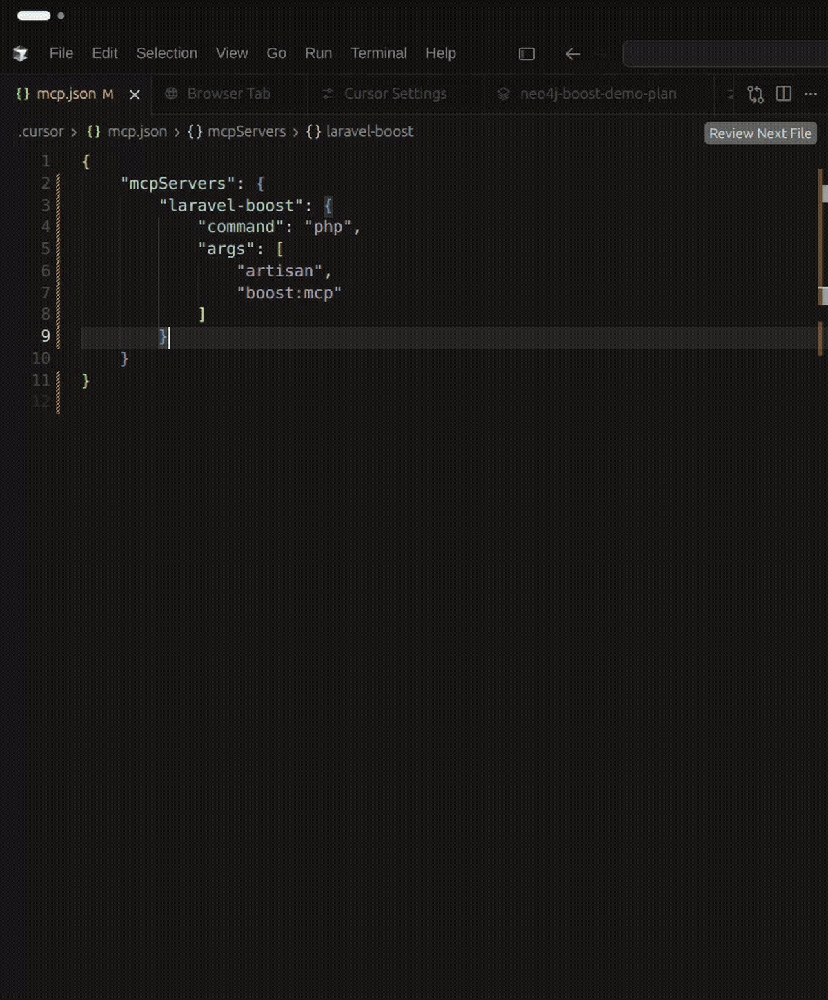
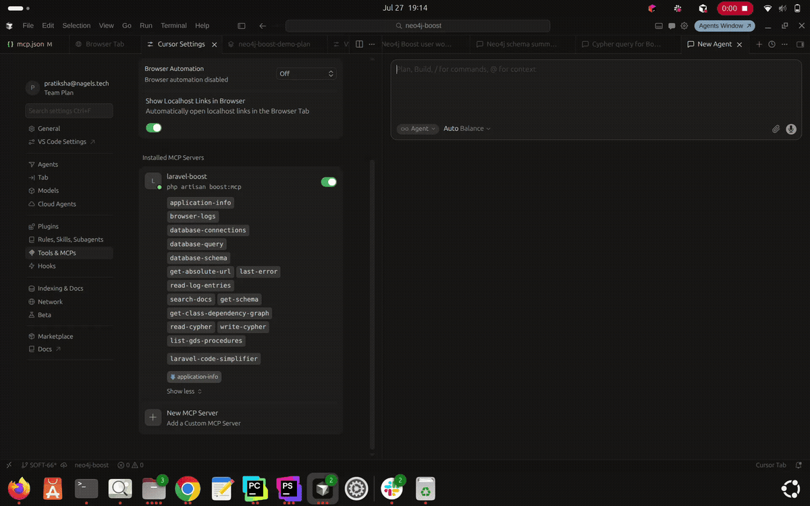

# Using Neo4j MCP Tools in Cursor

## Introduction

**Model Context Protocol (MCP)** lets an AI client (such as Cursor) discover tools and call them with structured arguments. Neo4j Boost registers Neo4j tools on Laravel Boost’s MCP server (`php artisan boost:mcp`), so Cursor can inspect a graph schema and run Cypher without leaving the IDE.

This tutorial assumes Neo4j Boost is already installed and healthy. It walks through one workflow:

**Configure Cursor → connect `laravel-boost` → inspect tools → `get-schema` → `read-cypher` → careful `write-cypher`**

For package concepts, see [What is Neo4j Boost?](what-is-neo4j-boost.md). For install and doctor checks, see [Getting Started](getting-started.md).

## Prerequisites

Complete [Getting Started with Neo4j Boost](getting-started.md) first (or equivalent setup), so that:

- `neo4j/laravel-boost` is installed in a Laravel 12/13 app
- STDIO (or another configured transport) is ready — typically `php artisan neo4j-boost:doctor` reports a healthy STDIO setup
- Neo4j is reachable with valid credentials (`NEO4J_URI`, `NEO4J_USERNAME`, `NEO4J_PASSWORD`)

You also need:

- [Cursor](https://cursor.com) with MCP support
- Your **Laravel application folder** open as the Cursor workspace (not only the `neo4j-boost` package repo, unless you are developing the package itself)

## How the Cursor Integration Works

With Laravel Boost present (required by this package), Cursor talks to **one** MCP server process. Neo4j Boost merges its tools into that server’s tool list.

```text
Cursor
  → Laravel Boost MCP (`php artisan boost:mcp`)
    → Neo4j Boost tools (get-schema, read-cypher, write-cypher, …)
      → Neo4jMcpClientInterface (stdio | http | driver)
        → Neo4j
```

Transport is selected with **`NEO4J_MCP_TRANSPORT`** (default `stdio`):

| Value | What Neo4j Boost tools do |
|-------|---------------------------|
| `stdio` (default) | Spawn the local official `neo4j-mcp` binary and call tools over STDIO |
| `http` | Call a Neo4j MCP HTTP endpoint (`NEO4J_MCP_URL`, default `http://localhost:8080/mcp`) |
| `driver` | Run the same tool names in-process over Bolt (`laudis/neo4j-php-client`); no `neo4j-mcp` binary |

Do not confuse this with **`NEO4J_TRANSPORT_MODE`**, which is used when configuring the **official Neo4j MCP binary/container**. This package’s Laravel config reads `NEO4J_MCP_TRANSPORT`, not `NEO4J_TRANSPORT_MODE`. See [README – Configuration](../../README.md#configuration).

Cursor’s connection to `boost:mcp` is always a local stdio command in `.cursor/mcp.json`. The Neo4j hop behind it follows `NEO4J_MCP_TRANSPORT`.

## Configure Cursor

Generate or refresh Cursor MCP config from the Laravel app root:

```bash
php artisan neo4j-boost:cursor-config
```

(`neo4j-boost:setup` runs this unless you pass `--no-cursor-config`.)

### What `cursor-config` writes

With Laravel Boost installed, `CursorMcpConfig` writes or merges a **`laravel-boost`** server entry. It does **not** add an `env` block:

```json
{
  "mcpServers": {
    "laravel-boost": {
      "command": "php",
      "args": ["artisan", "boost:mcp"]
    }
  }
}
```

Details:

| Item | Value |
|------|--------|
| Server name | `laravel-boost` |
| Command | `php` with args `artisan`, `boost:mcp` |
| `env` block | **Not** generated by `cursor-config` |
| Other servers | Existing unrelated MCP servers are kept |
| Old `neo4j-boost` HTTP entry | Removed when writing `laravel-boost`, so Neo4j tools stay on one server |

If Boost’s `ToolRegistry` class were missing, the fallback would be an HTTP `neo4j-boost` URL entry. That path is not the normal install: this package **requires** `laravel/boost`.

### `APP_ENV` / `APP_DEBUG`

Laravel Boost registers `boost:mcp` when **`APP_ENV=local`** or **`APP_DEBUG=true`**.

- In a typical Laravel app `.env` with `APP_ENV=local`, the generated JSON above is enough.
- If Cursor fails with missing `boost` commands or non-JSON stdout, set `APP_ENV=local` in `.env`, **or** add to the server entry:

```json
"env": {
  "APP_ENV": "local"
}
```

That `env` block is recommended in the README for this package’s own workbench/repo; it is optional when `.env` already enables Boost. See [README – Using with Cursor](../../README.md#using-with-cursor) and [Troubleshooting](../../README.md#troubleshooting).

## Start / Reload MCP in Cursor

From the [README – Using with Cursor](../../README.md#using-with-cursor) workflow:

1. Open the **Laravel application** directory as the Cursor workspace.
2. Confirm `.cursor/mcp.json` exists (run `neo4j-boost:cursor-config` if needed).
3. Reload Cursor or open MCP settings so Cursor picks up the config.
4. Enable / connect the **`laravel-boost`** server.

When connected, Cursor starts `php artisan boost:mcp` from the app directory. Neo4j tools appear alongside Laravel Boost’s own tools.



## Inspect Available MCP Tools

Neo4j Boost registers these tools on `boost:mcp`:

| Tool | Focus in this tutorial | Purpose |
|------|------------------------|---------|
| `get-schema` | Yes | Graph schema (labels, relationship types, property keys; richer output when APOC is available) |
| `read-cypher` | Yes | Read-only Cypher (`query`, optional `params`) |
| `write-cypher` | Yes | Write Cypher such as `CREATE`, `SET`, `DELETE` (`query`, optional `params`) |
| `list-gds-procedures` | Mention only | Lists GDS procedures; needs the GDS plugin on Neo4j |
| `get-class-dependency-graph` | Mention only | Laravel DI graph for a class; needs a prior `php artisan container:graph` export |

This tutorial focuses on schema and Cypher. For Laravel DI debugging with the exported container graph, see [Debug Laravel DI with the Container Graph](container-graph.md). GDS setup remains in the README GDS section.

You should also see Laravel Boost tools (for example `search-docs`, `browser-logs`, `database`) on the same `laravel-boost` server; those come from Boost, not from Neo4j Boost.

## Get the Neo4j Schema


`get-schema` takes **no arguments**. Ask Cursor something like:

> Use `get-schema` and summarize the labels, relationship types, and property keys in my Neo4j database.

What to expect:

- The tool calls through the configured transport (`stdio` / `http` / `driver`).
- Results describe the live database schema. Exact shape depends on transport and whether APOC is installed (driver mode uses `apoc.meta.schema` when available, otherwise a simpler labels / relationship-types / property-keys catalog).
- An empty database may return little or no schema detail.

Why start here: schema gives the assistant real labels and relationship types before it invents Cypher. Prefer asking for schema first, then writing queries against what came back—not against guessed names.

## Read Cypher


`read-cypher` parameters:

| Argument | Required | Description |
|----------|----------|-------------|
| `query` | Yes | Cypher string |
| `params` | No | Object/map of query parameters |

Example prompt (generic; adjust after you have schema):

> Use `read-cypher` to run:
>
> `MATCH (n) RETURN labels(n) AS labels, count(*) AS count ORDER BY count DESC LIMIT 10`

What to expect:

- A successful call returns query results as JSON from the MCP tool response.
- The tool is marked read-only in Laravel MCP (`IsReadOnly`).
- Under **`driver`** transport, Neo4j Boost rejects non-read statements (including `CREATE` / `MERGE` / `DELETE` / `SET`, and `PROFILE` / `EXPLAIN`) and tells you to use `write-cypher` instead. Under **`stdio`** / **`http`**, the official Neo4j MCP server enforces read-only behavior for this tool name.

Use `read-cypher` for exploration. Do not put mutations in this tool.

## Write Cypher



`write-cypher` parameters:

| Argument | Required | Description |
|----------|----------|-------------|
| `query` | Yes | Cypher string (writes allowed) |
| `params` | No | Object/map of query parameters |

**Important:** `write-cypher` **persists** changes. There is **no** automatic rollback or dry-run in this package. Cursor may show an approval UI for the tool call—treat that as a real mutation gate.

Use only against disposable local/dev data. Prefer a single query that creates and removes temporary data, for example:

> Use `write-cypher` to run:
>
> `CREATE (n:BoostDemoTemporary {name: 'temporary'}) WITH n DELETE n RETURN 1 AS completed`

That pattern creates a node and deletes it in the same statement so nothing is left behind if the query completes. It is **not** a transaction API or package-level rollback—just a self-contained demo query.

Never point destructive `DELETE` / `DETACH DELETE` (or broad `MATCH … SET`) at production graphs via the agent.

## Practical Workflow

A realistic AI-assisted loop:

1. **Ask Cursor to inspect the graph** — “What labels and relationships exist?”
2. **`get-schema`** — assistant calls the tool and summarizes real schema.
3. **Form Cypher** — write a `MATCH` based on returned labels/types (not invented names).
4. **`read-cypher`** — run the read query; review rows with the assistant.
5. **Decide** — if you only needed information, stop here.
6. **`write-cypher`** — only when you intentionally need a mutation; keep scope small and prefer non-production databases.

You remain responsible for reviewing tool arguments and results before accepting writes.

## Troubleshooting

Verified issues from the README and package behavior:

| Symptom | What to do |
|---------|------------|
| MCP “Loading tools” stuck / `artisan` not found | Open the Laravel **app** workspace; ensure `.cursor/mcp.json` exists (`neo4j-boost:cursor-config`) |
| Unexpected token / not valid JSON / no `boost` commands | Boost registers MCP when `APP_ENV=local` or `APP_DEBUG=true`. Fix `.env` or add `"env": { "APP_ENV": "local" }` to the `laravel-boost` entry |
| Tools missing Neo4j names | Confirm package is installed and `laravel-boost` is connected; Neo4j tools are merged into Boost’s include list at boot |
| Schema/Cypher tool errors | Check Neo4j credentials and transport (`NEO4J_MCP_TRANSPORT`). For STDIO, run `php artisan neo4j-boost:doctor` and optionally `php artisan neo4j-boost:test-stdio --tool=get-schema` |
| APOC / schema meta errors on local Docker Neo4j | `php artisan neo4j-boost:start-neo4j --recreate` |
| GDS / `list-gds-procedures` errors | Install and allowlist GDS; other tools still work without GDS |

Full reference: [README – Troubleshooting](../../README.md#troubleshooting).

## What's Next?

- Previous: [Getting Started](getting-started.md)
- Overview: [What is Neo4j Boost?](what-is-neo4j-boost.md)
- Next: [Debug Laravel DI with the Container Graph](container-graph.md)
- README: [Using with Cursor](../../README.md#using-with-cursor), [Single MCP server with Laravel Boost](../../README.md#single-mcp-server-with-laravel-boost), [Container Graph POC](../../README.md#container-graph-poc-llm-debugging)
