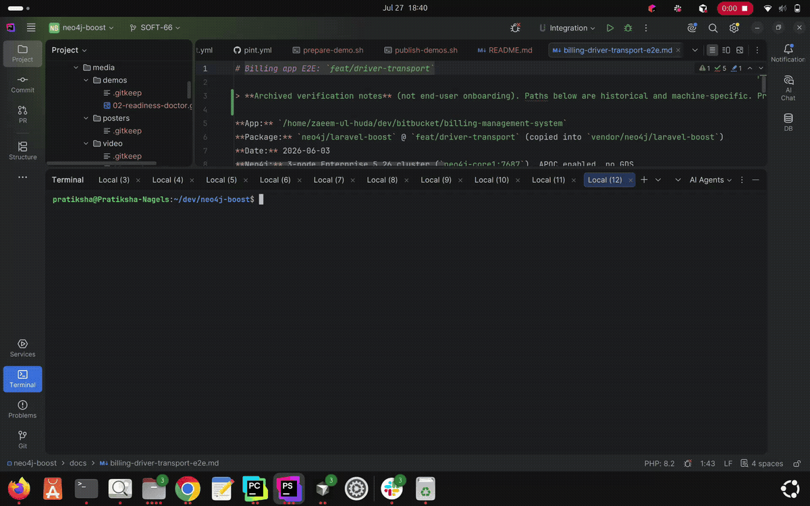
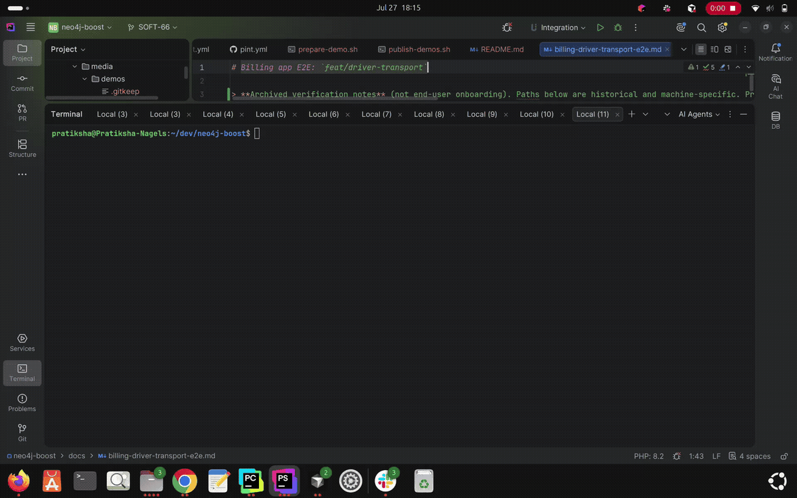

# Getting Started with Neo4j Boost

## Introduction

This tutorial walks you through a first-time local setup of **Neo4j Boost** (`neo4j/laravel-boost`) in a Laravel application.

By the end you will:

1. Install the package with Composer
2. Run interactive setup (`neo4j-boost:setup`)
3. Confirm readiness with the doctor (`neo4j-boost:doctor`)

The default path uses **driver transport**: Neo4j tools run in PHP over Bolt via `laudis/neo4j-php-client`. No `neo4j-mcp` binary is required. You can switch to **stdio** (local official binary) or **http** later.

If you only need the conceptual overview first, read [What is Neo4j Boost?](what-is-neo4j-boost.md).

## Prerequisites

Required by the current package:

- **PHP 8.2+**
- **Laravel 12 or 13**
- **Composer**
- A Laravel application where you can run `php artisan`

Pulled in automatically when you require this package:

- [Laravel Boost](https://github.com/laravel/boost) (`laravel/boost`)
- `laravel/mcp`
- `laudis/neo4j-php-client`

For the **local** onboarding path in this tutorial (setup auto-starting Neo4j):

- **Docker** available on your machine (`neo4j-boost:start-neo4j` uses the Docker CLI)
- Network access only if you later install the official Neo4j MCP binary (`neo4j-boost:install-mcp`)

Optional:

- On **Windows**, PHP **ext-zip** is needed for `neo4j-boost:install-mcp` (ZIP extraction). Linux and macOS use built-in `PharData`.

You do **not** need Graph Data Science (GDS) for this getting-started path. GDS is only required for the `list-gds-procedures` MCP tool.

## Installation

From your Laravel application directory:

```bash
composer require neo4j/laravel-boost
```

This installs `neo4j/laravel-boost` and its Composer dependencies (including Laravel Boost). Laravel auto-discovers `Neo4j\LaravelBoost\Neo4jBoostServiceProvider`, which registers the Artisan commands used below.

Before setup, set Neo4j credentials in your app `.env`. A password is required for doctor checks and for starting local Neo4j:

```env
NEO4J_URI=bolt://localhost:7687
NEO4J_USERNAME=neo4j
NEO4J_PASSWORD=your-password
```

How these variables are used:

| Variable | Read by this package? | Role |
|----------|----------------------|------|
| `NEO4J_URI` | Yes | Bolt URI for driver transport, container-graph export, and optional STDIO/HTTP MCP |
| `NEO4J_USERNAME` | Yes | Same as above |
| `NEO4J_PASSWORD` | Yes | Required for doctor, `start-neo4j`, and Neo4j tool calls |
| `NEO4J_MCP_TRANSPORT` | Yes | Selects package transport: `driver` (default), `stdio`, or `http` |
| `NEO4J_TRANSPORT_MODE` | **No** | Not read by `config/neo4j-boost.php`. Setup’s console reminder still prints it (and the README shows it in some STDIO examples); it is for the official Neo4j MCP binary / container, not for selecting this package’s transport |

You normally do **not** need to set `NEO4J_MCP_TRANSPORT` for this tutorial—it defaults to `driver`. Set it only if you switch to `stdio` or `http` later. See [README – Transport modes](../../README.md#transport-modes).

Setup does **not** write these values into `.env`; you set them yourself.

If you use `php artisan config:cache` in your environment, run `php artisan config:clear` after editing `.env` so commands see the new values.

Full install options (Composer hooks, HTTP mode, GDS): [README – Installation](../../README.md#installation).

## Interactive Setup

Run setup from your Laravel app root:

```bash
php artisan neo4j-boost:setup
```



### What setup is for

`neo4j-boost:setup` is the STDIO-first onboarding command. Interactively it:

1. Explains the default proxy path and prints an `.env` reminder
2. Offers to install the official `neo4j-mcp` binary
3. On first run (no setup marker yet), attempts to start local Neo4j; writes the marker **only if that start succeeds**
4. Writes or updates Cursor’s MCP config (unless you skip that step)

It does **not** replace reading the README for advanced transports or full configuration reference.

### Step-by-step (interactive)

1. **Proxy reminder**

   Setup prints that the default path is:

   `Boost MCP -> STDIO -> neo4j-mcp binary`

   It also prints an `.env` reminder that includes `NEO4J_TRANSPORT_MODE=stdio` plus `NEO4J_URI`, `NEO4J_USERNAME`, and `NEO4J_PASSWORD`. For this package, keep `NEO4J_PASSWORD` (and usually URI/username) set as in the [Installation](#installation) section; package transport is selected with `NEO4J_MCP_TRANSPORT`, which already defaults to `driver`.

2. **Install the Neo4j MCP binary?**

   You are prompted:

   > Install the official Neo4j MCP server binary for this project?

   Default is **yes**. Accepting runs `neo4j-boost:install-mcp` with `--no-cursor-config` so Cursor config is handled later in setup. The binary is downloaded for your platform from the configured Neo4j MCP release version (`neo4j_mcp.version` in config, overridable with `NEO4J_MCP_VERSION`).

   Setup options:

   - `--install-mcp` — install the binary without prompting
   - `--skip-mcp` — skip binary installation
   - `--no-cursor-config` — skip the `neo4j-boost:cursor-config` step at the end

3. **First-time local Neo4j**

   If `storage/app/neo4j-mcp/.setup-complete` is **missing**, setup prints that first-time setup was detected and calls:

   ```bash
   php artisan neo4j-boost:start-neo4j
   ```

   That starts a Docker container (default name `neo4j-boost-local`, default image `neo4j:5-community`) with:

   - Host Bolt port `7687` → container `7687`
   - Host HTTP port `7474` → container `7474`
   - APOC enabled via `NEO4J_PLUGINS=["apoc"]` and APOC procedure allowlists

   Requirements for this step: Docker CLI available and a running Docker daemon, and `NEO4J_PASSWORD` set (or pass `--password=` when calling `start-neo4j` yourself).

   - On **success**, setup writes `storage/app/neo4j-mcp/.setup-complete` (timestamp contents).
   - On **failure**, setup warns you to run `php artisan neo4j-boost:start-neo4j` after fixing Docker/password, and does **not** write the marker—so the next interactive setup will try auto-start again.

   Once the marker exists, later setup runs skip auto-start. You can still start or recreate Neo4j manually:

   ```bash
   php artisan neo4j-boost:start-neo4j
   php artisan neo4j-boost:start-neo4j --recreate
   ```

   `--recreate` removes and recreates the container when you need to re-apply APOC/plugin settings (for example if doctor/setup previously found a container missing APOC).

4. **Cursor MCP config**

   Unless you pass `--no-cursor-config`, setup runs:

   ```bash
   php artisan neo4j-boost:cursor-config
   ```

   With Laravel Boost present (required by this package), that creates or updates `.cursor/mcp.json` roughly like:

   ```json
   {
     "mcpServers": {
       "laravel-boost": {
         "command": "php",
         "args": ["artisan", "boost:mcp"]
       }
     }
   }
   ```

   Existing unrelated MCP servers are kept. A separate `neo4j-boost` HTTP server entry is removed when the `laravel-boost` entry is written, so Neo4j tools stay on one server. **`cursor-config` does not add an `env` block**; see troubleshooting below for when `APP_ENV=local` matters.

5. **Completion message**

   After the steps above, setup reports one of these outcomes (exact wording from the command):

   | Condition | Output |
   |-----------|--------|
   | Binary installed **and** `NEO4J_PASSWORD` set | `Neo4j Laravel Boost setup complete. STDIO transport is ready with the local neo4j-mcp binary.` |
   | Binary installed **but** password missing | `Neo4j password is required for STDIO mode. Set a valid Neo4j password in your .env: NEO4J_PASSWORD=...` |
   | Binary still missing | `Setup finished, but neo4j-mcp binary is not installed. Run php artisan neo4j-boost:install-mcp or re-run setup.` |

### Non-interactive mode

```bash
php artisan neo4j-boost:setup --no-interaction
```

After the proxy/`.env` reminder, this prints manual steps only (install MCP, start Neo4j, set `.env`, run `cursor-config`) and returns without installing the binary, starting Neo4j, or writing Cursor config. Use interactive setup for the guided path in this tutorial.

## Verify Your Setup with Readiness Doctor

After setup, confirm the STDIO path looks healthy:

```bash
php artisan neo4j-boost:doctor
```



### Why use doctor?

`neo4j-boost:doctor` diagnoses Neo4j MCP readiness and prints suggested fixes. Use it before troubleshooting Cursor: it separates “binary / password / transport” problems from IDE MCP client issues.

### What it prints (default STDIO)

Doctor first shows the proxy architecture for the current transport. For STDIO:

```text
Cursor / IDE -> Laravel Boost MCP (php artisan boost:mcp) -> STDIO -> neo4j-mcp binary -> Neo4j
```

Then it reports status rows. For a successful **local STDIO** setup you want:

| Check | Successful value |
|-------|------------------|
| Transport | `stdio` |
| Neo4j MCP binary | `installed` |
| `NEO4J_PASSWORD` | `set` |
| STDIO readiness | `ready` |

**STDIO readiness** is `ready` only when the binary is installed **and** `NEO4J_PASSWORD` is set. That matches what setup treats as “STDIO transport is ready.”

If the binary is missing, doctor warns and (when interactive) can offer to run `neo4j-boost:install-mcp` for you. It may also print suggested resolutions (for example, run setup to install the binary, or set `NEO4J_PASSWORD`).

### Other transports (brief)

When `NEO4J_MCP_TRANSPORT` is **not** `stdio`, doctor does **not** print `STDIO readiness`. Instead it prints:

| Check | Meaning |
|-------|---------|
| Neo4j MCP HTTP | `reachable` / `not reachable` |
| Configured URL | HTTP MCP URL from config (default `http://localhost:8080/mcp`) |

The non-stdio architecture line also describes an HTTP hop (`… -> HTTP -> neo4j-mcp -> Neo4j`), including when transport is `driver`. That UI path is shared for every non-`stdio` value today; `driver` mode itself runs tools in-process over Bolt and does not require the `neo4j-mcp` binary. Driver is the default; use STDIO only if you install the `neo4j-mcp` binary. Details: [README – Configuration](../../README.md#transport-modes).

## Troubleshooting

Common issues for this onboarding path:

| Symptom | What to do |
|---------|------------|
| Doctor: `NEO4J_PASSWORD` missing / STDIO not ready | Set `NEO4J_PASSWORD` in `.env`, then `php artisan config:clear` if you use config caching |
| Doctor: Neo4j MCP binary missing | Re-run `php artisan neo4j-boost:setup` or `php artisan neo4j-boost:install-mcp` |
| Setup could not auto-start Neo4j | Ensure Docker is running and password is set; run `php artisan neo4j-boost:start-neo4j` |
| Existing container missing APOC settings | `php artisan neo4j-boost:start-neo4j --recreate` |
| Cursor / `boost:mcp` JSON or “boost namespace” errors | Open the **Laravel app** folder as the Cursor workspace and ensure `.cursor/mcp.json` exists. Laravel Boost registers `boost:mcp` when `APP_ENV=local` **or** `APP_DEBUG=true`. In a normal app `.env` that already has `APP_ENV=local`, you usually need nothing extra. If Boost commands are missing, set `APP_ENV=local` in `.env`, or add `"env": { "APP_ENV": "local" }` under the `laravel-boost` entry in `.cursor/mcp.json` (see [README – Troubleshooting](../../README.md#common-issues--troubleshooting)) |

For the full list (HTTP MCP, Docker hostnames, GDS, and more), see [README – Troubleshooting](../../README.md#common-issues--troubleshooting).

Optional deeper STDIO check after doctor looks good:

```bash
php artisan neo4j-boost:test-stdio --tool=get-schema
```

`neo4j-boost:test-stdio` exercises the STDIO handshake and a tool call. `--tool` defaults to `get-schema`; other allowed values are `read-cypher` and `write-cypher` (those need `--query=`). The command expects `NEO4J_MCP_TRANSPORT=stdio`, an installed binary, and `NEO4J_PASSWORD` set.

## What's Next?

- Overview: [What is Neo4j Boost?](what-is-neo4j-boost.md)
- Next: [Using Neo4j MCP Tools in Cursor](cursor-mcp-tools.md)
- Then: [Debug Laravel DI with the Container Graph](container-graph.md)
- README reference: [Cursor](../../README.md#cursor), [5-minute Quick Start](../../README.md#5-minute-quick-start)
